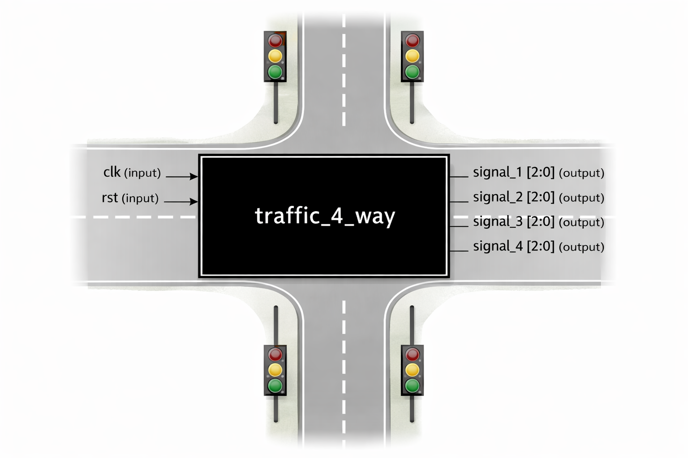

# 4-Way Traffic Light Controller (Verilog)
## Overview

Implements a 4-way traffic light controller using Verilog HDL.

Controls four signals (signal_1 to signal_4) at an intersection.

Cycles signals through the standard Green → Yellow → Red sequence.

Uses a finite state machine (FSM) for sequential control.

Fully synchronous design using a clock (clk) and active-high reset (rst).

## Inputs and Outputs

### Inputs:

clk – Clock signal

rst – Active-high reset

### Outputs:

signal_1 – 3-bit traffic light for road 1

signal_2 – 3-bit traffic light for road 2

signal_3 – 3-bit traffic light for road 3

signal_4 – 3-bit traffic light for road 4

## Traffic light encoding:

RED = 3'b100

YELLOW = 3'b010

GREEN = 3'b001

## Design Details

Uses 8 states (S0 to S7) in FSM to control light sequences.

## Timing parameters:

Green light duration = 8 clock cycles

Yellow light duration = 2 clock cycles

## State transitions:

S0 — S1 — S2 — S3 — S4 — S5 — S6 — S7 — S0

Each state will be assigned a Green or Yellow phase on one road, while the remaining roads will be in the Red phase.

Combinational logic sets the output signals based on the current state.

## Block Diagram

## Learning Outcomes

Understanding FSM-based control in Verilog.

Practice with combinational and sequential logic.

Timing control using counters.

Multi-output control system design in HDL.

